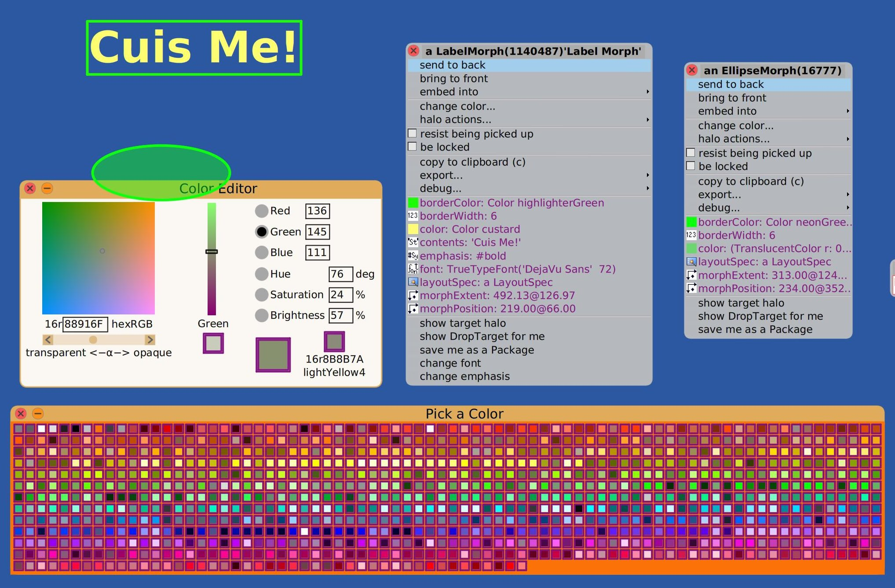

# Cuis-Smalltalk-UI

Morphic UI widgets, components and tools to design and explore graphic
user interface with [Cuis-Smalltalk](http://cuis.st).

There are two packages **UI-Components** and
**UI-MetaProperties**, those will to install all related
packages. Of course you can also install individually the component
you are interested by, the dependency mechanism of Package will also
install the needed additional packages.

## UI-Components
A meta-package to install all the component packages described in the
sections below. Those packages are in the 'lib' directory.

```smalltalk
Feature require: 'UI-Components'.
```

### UI-Core
Model and helper classes.
- FrameMorph
- LineMorph
- ListModel
 - ListMultiModel
- SignMorph
- SqueezeLabelMorph
- ValueHolder
- WindowTitleMorph

### UI-Click-Select
- CheckButtonMorph
 - RadioButtonMorph
- CheckGroup
 - PluggableCheckboxMorph
 - RadioGroup
- DropDownButtonMorph
 - DropDownListMorph
- Flap
- FlapItem
- InnerListOfMorph
- MultiSelectMenu
- PluggableDropDownListMorph
- PluggableListOfMorph
 - PluggableDropDownList

### UI-Color-Panel
- ColorEditorModel
- ColorEditorPanel
- ColorPalette
- ColorPaneMorph
- ColorSliderMorph

### UI-DragAndDrop
- ClickColorMorph
- DropColorMorph
- FontMorph

### UI-Entry
- SimpleEditor
- TextEntryMorph
- SimpleNumberEntryMorph

### UI-Graphic-Import
- IconImporter

### UI-Panel
- BreadcrumbsPane
- DecoratedPane
- FlowLayoutMorph
- Panel
 - DialogPanel
  - EditPanel
  - PluggableDialogPanel
   - PluggablePane
  - ValueEntryPanel
   - CharacterEntryPanel
   - FloatEntryPanel
   - PointEntryPanel
   - PositiveIntegerEntryPanel
   - PositiveFloatEntryPanel
   - RangeFloatEntryPanel
   - StringEntryPanel
    - TextEntryPanel
 - WizardPanel
- PluggableScrollBar
- WizardPage

### UI-Table
- AlignedLabelMorph
- Column
 - NumberColumn
- Table
-TableMorph
-TableStyle

### UI-Widgets
- ButtonMorph
- ChevronMorph
 - DropDownChevronMorph
- CircularToolbarMorph
 - CircularSubToolbarMorph
- LabelGroup
- PreviewMorph
 - FilePreviewMorph
- WaitSpinner
- WheelMorph

## Tools of interest
A collection of packages related to GUI construction and editing.

### UI-Mold, UI-Mold-Test
A helper tool to describe dialog panels for user input and validation.
- Field
 - CheckBoxField
 - DateField
 - FloatField
  - PercentageField
 - IntegerField
 - PasswordField
 - SelectField
  - SelectMultipleField
 - TextField
 - TimeField
- Mold
- MoldExample

### UI-Preference
A dialog panel to edit system or application preferences.

- PreferenceBrowser
- PreferenceBrowserVisitor
- PreferenceModel
 - PreferenceModelClosure
- PreferenceType


## Visual Properties
Visual Properties of a Morph are in most cases simple values. As a
result, flexible viewing and accessing approaches for these values can
be created easily. Visual Properties can be annotated with
MetaProperties so that their construction menu allows easy access.

To enchance Morph with visual editing properties install the ad-hoc
package. It will install meta-properties extension and the required
dependencies.

```smalltalk
Feature require: 'UI-MetaProperties'.
```

Once you have done this, you can open the World Menu and get a New Morph.

If you then command-click on this Morph, you see the construction handles.

Clicking on the blue Menu button, you will get the Morph's menu.
Click the push-pin on the upper right to keep this menu around.

Here is a view with a LabelMorph, an EllipseMorph, their associated menus,
as well as Color Palette and a Color Editor Panel.



The _purple_ menu items are Visual Properties.

Clicking on such a VisualPropertyMenuItem gives
either an editor or a choice of selection palettes.

You can also _drag_ values to or from a VisualPropertyMenuItem
to transfer values.

You can drag a Color to or from the Color Editor or from a Color Palette
and drop onto any area which takes a Color.

The basic mechanics of this are described in files
'https://github.com/Cuis-Smalltalk/Cuis-Smalltalk-UI/blob/main/VisualMetaPropGist.md'
and
'https://github.com/Cuis-Smalltalk/Cuis-Smalltalk-Dev/blob/master/Documentation/DragAndDrop.md' 


### UI-MetaProperties
- MetaProperty
 - MetaPropertyFrom
 - MetaPropertyOneOf
  - MetaPropertyMultiSelect
- MetaPropertyRange
- MetaPropertyTransducer
- MetaPropertyViaTest
- MorphMessageBox
- OrdinaryPropertyMenuItem
- VisualPropertyEditor
- VisualPropertyMenuItem

### UI-Color-Panel
- ColorEditorModel
- ColorEditorPanel
- ColorPalette
- ColorPaneMorph
- ColorSliderMorph

### UI-Edit-Lens
- MorphEditLens

### UI-Layout-Panel
- LayoutMorphEditPanel
- LayoutSpecEditPanel

### UI-Packager
Save combined Morph into a package which requires its dependent code.

To each Morph menu, it provides a "save me as a Package" entry.  This
lets you save a composite Morph (one with submorphs) as a Package
which in turn requires the packages containing the code implementing
the composite Morph.

One can then go to a base image and "Feature require:" the created
Package whose initializer restores the saved composite Morph.

### UI-Palette
- ImagePickerPanel
 - PickAColorPalette
 - PickALargerIconPalette
 - PickAnIconPalette
 - PaletteLayoutMorph
- InnerPluggableImagePalette
- PaletteLayoutMorph
- PluggableImagePalette

### UI-Shapes
- ArrowMorph
- BezierQuadraticMorph
 - BezierCubicMorph
- CircleShapeMorph 
- EllipseMorph
- PointerLineMorph
LineShapeMorph
RectangleShapeMorph


